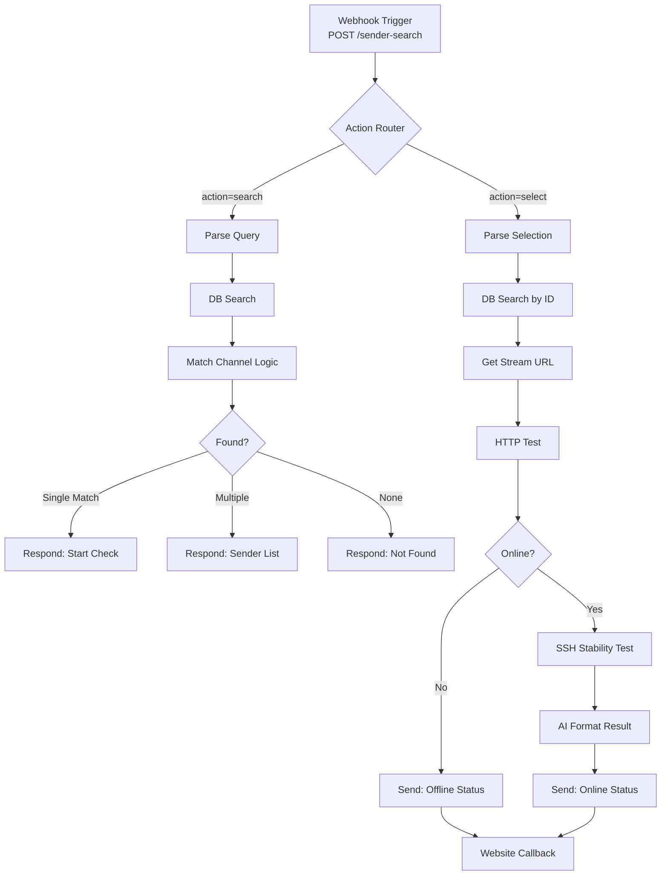

# n8n Workflow Migration: Telegram → Webseite

Dieser Leitfaden zeigt dir, wie du deinen bestehenden Telegram-Workflow für die Webseite adaptierst.

## 📋 Übersicht: Was ändert sich?

### Telegram-Workflow (Vorher)
```
Telegram Trigger (message/callback_query)
    ↓
Verzweigung: Message oder Callback?
    ↓ Message                    ↓ Callback
Parse Query                  Extract ID
    ↓                            ↓
DB Search                    DB Search
    ↓                            ↓
Match Logic                  Match Logic
    ↓                            ↓
Telegram Message mit         Telegram Callback Answer
Inline Keyboard              + HTTP/SSH Test
```

### Web-Workflow (Nachher)
```
Webhook Trigger (POST von Webseite)
    ↓
Verzweigung: Sender-Suche oder Auswahl?
    ↓ Suche                     ↓ Auswahl
Parse Input                  Extract ID
    ↓                            ↓
DB Search                    DB Search
    ↓                            ↓
Match Logic                  Match Logic
    ↓                            ↓
Respond to Webhook           Respond to Webhook
(Senders-Array)              + HTTP/SSH Test im Hintergrund
                                ↓
                             HTTP Request an /api/n8n/webhook
                             (Status-Update)
```

---

## 🔄 Node-by-Node Konvertierung

### 1. Telegram Trigger → Webhook Trigger

**Vorher (Telegram):**
```json
{
  "node": "Telegram Trigger",
  "type": "n8n-nodes-base.telegram",
  "parameters": {
    "updates": ["message", "callback_query"]
  }
}
```

**Nachher (Webhook):**
```json
{
  "node": "Webhook Trigger",
  "type": "n8n-nodes-base.webhook",
  "parameters": {
    "httpMethod": "POST",
    "path": "sender-search",
    "responseMode": "responseNode",
    "options": {}
  }
}
```

**Webhook URL:** `https://your-n8n.com/webhook/sender-search`

**Erwartete Payload von Webseite:**
```json
{
  "action": "search",
  "senderName": "Sky Bundesliga",
  "userId": "emby-user-123"
}
```

oder für Sender-Auswahl:
```json
{
  "action": "select",
  "senderId": 103877,
  "userId": "emby-user-123"
}
```

---

### 2. Callback or Message → Action Switch

**Vorher (Telegram):**
```javascript
// Node: "Callback or Message"
// Prüft ob callback_query existiert
{{ !!$json.callback_query }}
```

**Nachher (Webhook):**
```javascript
// Node: "Action Router"
// Prüft das 'action' Feld im Body
{{ $json.body.action === 'select' }}
```

**n8n Configuration:**
```json
{
  "node": "Action Router",
  "type": "n8n-nodes-base.if",
  "parameters": {
    "conditions": {
      "conditions": [
        {
          "leftValue": "={{ $json.body.action }}",
          "rightValue": "select",
          "operator": {
            "type": "string",
            "operation": "equals"
          }
        }
      ]
    }
  }
}
```

---

### 3. Parse Query (bleibt fast gleich!)

**Vorher (Telegram):**
```javascript
const msg = $node["Extract Inputs"].json.message?.text ?? "";
const chat_id = $node["Extract Inputs"].json.message?.chat?.id;
const message_id = $node["Extract Inputs"].json.message?.message_id;
```

**Nachher (Webhook):**
```javascript
// Node: "Parse Query"
const msg = $json.body?.senderName ?? "";
const userId = $json.body?.userId ?? "";

// Bereinigung bleibt IDENTISCH:
let t = msg
  .replace(/^\/\w+(?:@\w+)?\s*/i, "")
  .replace(/^\s+|\s+$/g, "");

t = t
  .replace(/^\s*(ist|geht|läuft)\s+(der|die|das)\s+kanal\s+/i, "")
  .replace(/^\s*(ist|geht|läuft)\s+/i, "")
  .replace(/\s+(down|online|an|aus|gerade)\s*$/i, "")
  .replace(/[?!.]+$/g, "")
  .replace(/\s+/g, " ")
  .trim();

if (!t) t = msg.trim();

return [{
  json: {
    channel_query: t,
    user_id: userId  // statt chat_id
  }
}];
```

---

### 4. DB Search (100% identisch!)

Deine Postgres-Query bleibt **exakt gleich**:
```sql
WITH
inp AS (
  SELECT
    lower(unaccent($1)) AS raw,
    trim(regexp_replace(...)) AS qclean
),
-- ... rest deiner Query
```

Keine Änderungen nötig! 🎉

---

### 5. Match Channel (minimale Anpassungen)

**Vorher (Telegram):**
```javascript
const wanted = $item(0).$node["Parse Query"]?.json?.channel_query ?? "";
const chatId = $item(0).$node["Parse Query"]?.json?.chat_id ?? null;
const messageId = $item(0).$node["Parse Query"]?.json?.message_id ?? null;

return [{
  json: {
    found: true,
    need_choice: false,
    match_name: top.name,
    stream_id: top.stream_id,
    probe_url: top.direct_source,
    suggestions,
    wanted,
    chat_id: chatId,
    message_id: messageId
  }
}];
```

**Nachher (Webhook):**
```javascript
const wanted = $item(0).$node["Parse Query"]?.json?.channel_query ?? "";
const userId = $item(0).$node["Parse Query"]?.json?.user_id ?? null;

return [{
  json: {
    found: true,
    need_choice: false,
    match_name: top.name,
    stream_id: top.stream_id,
    probe_url: top.direct_source,
    suggestions,
    wanted,
    user_id: userId  // statt chat_id/message_id
  }
}];
```

---

### 6. Inline Keyboard → Respond to Webhook

**Vorher (Telegram Send Message):**
```javascript
// Node: "Build Keyboard"
function buildKeyboard(suggestions, perRow = 1) {
  const arr = Array.isArray(suggestions) ? suggestions : [];
  const rows = [];
  for (let i = 0; i < arr.length; i += perRow) {
    rows.push(arr.slice(i, i + perRow).map(s => ({
      text: String(s.name ?? s.id),
      callback_data: `chk:${s.id}`
    })));
  }
  return { inline_keyboard: rows };
}

return [{
  json: {
    chat_id: j.chat_id,
    text: "Bitte einen Kanal wählen",
    reply_markup: buildKeyboard(j.suggestions, 1)
  }
}];
```

```json
{
  "node": "Telegram Send Message",
  "type": "n8n-nodes-base.telegram",
  "parameters": {
    "chatId": "={{ $json.chat_id }}",
    "text": "={{ $json.text }}",
    "replyMarkup": "inlineKeyboard",
    "inlineKeyboard": "={{ $json.reply_markup }}"
  }
}
```

**Nachher (Respond to Webhook):**
```javascript
// Node: "Format Response"
const suggestions = $json.suggestions || [];

return [{
  json: {
    status: "needs_selection",
    message: "Mehrere Sender gefunden",
    senders: suggestions.map(s => ({
      id: s.id,
      name: s.name
    }))
  }
}];
```

```json
{
  "node": "Respond to Webhook",
  "type": "n8n-nodes-base.respondToWebhook",
  "parameters": {
    "respondWith": "json",
    "responseBody": "={{ $json }}",
    "options": {
      "responseCode": 200,
      "responseHeaders": {
        "entries": [
          {
            "name": "Content-Type",
            "value": "application/json"
          }
        ]
      }
    }
  }
}
```

---

### 7. Extract Callback ID → Parse Selection

**Vorher (Telegram Callback):**
```javascript
// Node: "extract name"
const cq = $json.callback_query;
if (!cq?.data) return [];

const m = String(cq.data).match(/^chk(?:id)?:([0-9]+)$/);
if (!m) return [];

return [{
  json: {
    chosen_id: Number(m[1]),
    chat_id: cq.message?.chat?.id,
    cqid: cq.id
  }
}];
```

**Nachher (Webhook):**
```javascript
// Node: "Parse Selection"
const body = $json.body;
if (!body?.senderId) return [];

return [{
  json: {
    chosen_id: Number(body.senderId),
    user_id: body.userId
  }
}];
```

---

### 8. HTTP Request + SSH Test (bleibt identisch!)

Deine komplette Test-Logik bleibt **unverändert**:

```json
{
  "node": "HTTP Request",
  "type": "n8n-nodes-base.httpRequest",
  "parameters": {
    "url": "={{ $json.probe_url }}",
    "method": "HEAD",
    "options": {
      "timeout": 8000,
      "fullResponse": true,
      "neverError": true
    }
  }
}
```

```json
{
  "node": "Execute a command (SSH)",
  "type": "n8n-nodes-base.ssh",
  "parameters": {
    "command": "=#!/bin/bash\nurl=\"{{ $json.probe_url }}\"\n...\n# Dein komplettes Bash-Script!"
  }
}
```

**Einzige Änderung:** Statt Telegram-Message am Ende:

---

### 9. Final Result → HTTP Request zu Webseite

**Vorher (Telegram Send Message):**
```json
{
  "node": "Channel Up",
  "type": "n8n-nodes-base.telegram",
  "parameters": {
    "chatId": "={{ $json.chat_id }}",
    "text": "={{ $json.output }}"
  }
}
```

**Nachher (HTTP Request zu Webseite):**
```json
{
  "node": "Send Status to Website",
  "type": "n8n-nodes-base.httpRequest",
  "parameters": {
    "method": "POST",
    "url": "https://your-website.com/api/n8n/webhook",
    "authentication": "genericCredentialType",
    "genericAuthType": "httpHeaderAuth",
    "sendBody": true,
    "bodyParameters": {
      "parameters": [
        {
          "name": "userId",
          "value": "={{ $json.user_id }}"
        },
        {
          "name": "senderId",
          "value": "={{ $json.stream_id }}"
        },
        {
          "name": "status",
          "value": "={{ $json.live ? 'online' : 'offline' }}"
        },
        {
          "name": "message",
          "value": "={{ $json.output }}"
        },
        {
          "name": "details",
          "value": "={{ JSON.stringify({ quality: $json.quality, latency: $json.avg_latency_ms }) }}"
        }
      ]
    },
    "options": {
      "timeout": 5000
    }
  }
}
```

**Credentials Setup:**
- Type: Header Auth
- Name: `X-N8N-Webhook-Secret`
- Value: `your-secret-from-.env`

---

## 📊 Kompletter neuer Workflow (vereinfacht)



---

## ⚙️ Vollständiger n8n Workflow-Code

Hier ist der komplette neue Workflow als JSON:

```json
{
  "name": "Web TV Sender Check",
  "nodes": [
    {
      "parameters": {
        "httpMethod": "POST",
        "path": "sender-search",
        "responseMode": "responseNode",
        "options": {}
      },
      "name": "Webhook",
      "type": "n8n-nodes-base.webhook",
      "typeVersion": 1.1,
      "position": [240, 300],
      "webhookId": "your-webhook-id"
    },
    {
      "parameters": {
        "conditions": {
          "string": [
            {
              "value1": "={{$json.body.action}}",
              "operation": "equals",
              "value2": "select"
            }
          ]
        }
      },
      "name": "Action Router",
      "type": "n8n-nodes-base.if",
      "typeVersion": 1,
      "position": [460, 300]
    },
    {
      "parameters": {
        "jsCode": "const msg = $json.body?.senderName ?? \"\";\nconst userId = $json.body?.userId ?? \"\";\n\nlet t = msg\n  .replace(/^\\/\\w+(?:@\\w+)?\\s*/i, \"\")\n  .replace(/^\\s+|\\s+$/g, \"\");\n\nt = t\n  .replace(/^\\s*(ist|geht|läuft)\\s+(der|die|das)\\s+kanal\\s+/i, \"\")\n  .replace(/^\\s*(ist|geht|läuft)\\s+/i, \"\")\n  .replace(/\\s+(down|online|an|aus|gerade)\\s*$/i, \"\")\n  .replace(/[?!.]+$/g, \"\")\n  .replace(/\\s+/g, \" \")\n  .trim();\n\nif (!t) t = msg.trim();\n\nreturn [{\n  json: {\n    channel_query: t,\n    user_id: userId\n  }\n}];"
      },
      "name": "Parse Query",
      "type": "n8n-nodes-base.code",
      "typeVersion": 2,
      "position": [680, 180]
    },
    {
      "parameters": {
        "jsCode": "const body = $json.body;\nif (!body?.senderId) return [];\n\nreturn [{\n  json: {\n    chosen_id: Number(body.senderId),\n    user_id: body.userId\n  }\n}];"
      },
      "name": "Parse Selection",
      "type": "n8n-nodes-base.code",
      "typeVersion": 2,
      "position": [680, 420]
    },
    {
      "parameters": {
        "operation": "executeQuery",
        "query": "-- DEINE KOMPLETTE BESTEHENDE QUERY!\nWITH inp AS (...)\nSELECT stream_id, name, direct_source, total_score\nFROM filtered\nORDER BY total_score DESC\nLIMIT 5;",
        "options": {
          "queryReplacement": "={{ $json.channel_query }}"
        }
      },
      "name": "DB Search",
      "type": "n8n-nodes-base.postgres",
      "typeVersion": 2.4,
      "position": [900, 180]
    },
    {
      "parameters": {
        "operation": "executeQuery",
        "query": "SELECT stream_id, name, direct_source\\nFROM channels\\nWHERE stream_id = $1\\nLIMIT 1;",
        "options": {
          "queryReplacement": "={{ $json.chosen_id }}"
        }
      },
      "name": "DB Search by ID",
      "type": "n8n-nodes-base.postgres",
      "typeVersion": 2.4,
      "position": [900, 420]
    },
    {
      "parameters": {
        "jsCode": "// DEINE BESTEHENDE MATCH-LOGIK!\nconst rows = $input.all().map(i => i.json);\nconst wanted = $item(0).$node[\"Parse Query\"]?.json?.channel_query ?? \"\";\nconst userId = $item(0).$node[\"Parse Query\"]?.json?.user_id ?? null;\n\nif (!rows.length) {\n  return [{ json: { found: false, need_choice: false, suggestions: [], wanted, user_id: userId }}];\n}\n\nrows.sort((a,b) => (b.total_score ?? 0) - (a.total_score ?? 0));\nconst top = rows[0];\nconst second = rows[1];\nconst suggestions = rows.slice(0, 5).map(r => ({ id: r.stream_id, name: r.name }));\n\nconst gap = (top.total_score ?? 0) - (second?.total_score ?? -Infinity);\nconst needChoice = rows.length > 1 && gap < 0.25;\n\nif (needChoice) {\n  return [{ json: { found: false, need_choice: true, suggestions, wanted, user_id: userId }}];\n}\n\nif (top?.direct_source && /^https?:\\/\\//i.test(top.direct_source)) {\n  return [{ json: { found: true, need_choice: false, match_name: top.name, stream_id: top.stream_id, probe_url: top.direct_source, suggestions, wanted, user_id: userId }}];\n}\n\nreturn [{ json: { found: false, need_choice: false, suggestions, wanted, user_id: userId }}];"
      },
      "name": "Match Channel",
      "type": "n8n-nodes-base.code",
      "typeVersion": 2,
      "position": [1120, 180]
    },
    {
      "parameters": {
        "conditions": {
          "boolean": [
            {
              "value1": "={{$json.need_choice}}",
              "value2": true
            }
          ]
        }
      },
      "name": "Needs Selection?",
      "type": "n8n-nodes-base.if",
      "typeVersion": 1,
      "position": [1340, 180]
    },
    {
      "parameters": {
        "respondWith": "json",
        "responseBody": "={{ { \"status\": \"needs_selection\", \"message\": \"Mehrere Sender gefunden\", \"senders\": $json.suggestions } }}"
      },
      "name": "Respond: Selection",
      "type": "n8n-nodes-base.respondToWebhook",
      "typeVersion": 1,
      "position": [1560, 80]
    },
    {
      "parameters": {
        "respondWith": "json",
        "responseBody": "={{ { \"status\": \"checking\", \"message\": \"Prüfe \" + $json.match_name, \"senderId\": $json.stream_id } }}"
      },
      "name": "Respond: Start Check",
      "type": "n8n-nodes-base.respondToWebhook",
      "typeVersion": 1,
      "position": [1560, 280]
    },
    {
      "parameters": {
        "url": "={{$json.probe_url}}",
        "method": "HEAD",
        "options": {
          "timeout": 8000,
          "fullResponse": true,
          "neverError": true
        }
      },
      "name": "HTTP Test",
      "type": "n8n-nodes-base.httpRequest",
      "typeVersion": 4.1,
      "position": [1780, 280]
    },
    {
      "parameters": {
        "command": "=#!/bin/bash\\nurl=\"{{ $json.probe_url }}\"\\n# DEIN KOMPLETTES BASH-SCRIPT!"
      },
      "name": "SSH Stability Test",
      "type": "n8n-nodes-base.ssh",
      "typeVersion": 1,
      "position": [2220, 280]
    },
    {
      "parameters": {
        "method": "POST",
        "url": "https://your-website.com/api/n8n/webhook",
        "authentication": "genericCredentialType",
        "genericAuthType": "httpHeaderAuth",
        "sendBody": true,
        "specifyBody": "json",
        "jsonBody": "={{ { \"userId\": $json.user_id, \"senderId\": $json.stream_id, \"status\": $json.live ? \"online\" : \"offline\", \"message\": $json.output, \"details\": JSON.stringify({ quality: $json.quality, latency: $json.avg_latency_ms }) } }}",
        "options": {}
      },
      "name": "Send to Website",
      "type": "n8n-nodes-base.httpRequest",
      "typeVersion": 4.1,
      "position": [2660, 280]
    }
  ],
  "connections": {
    "Webhook": {
      "main": [[{ "node": "Action Router", "type": "main", "index": 0 }]]
    },
    "Action Router": {
      "main": [
        [{ "node": "Parse Query", "type": "main", "index": 0 }],
        [{ "node": "Parse Selection", "type": "main", "index": 0 }]
      ]
    },
    "Parse Query": {
      "main": [[{ "node": "DB Search", "type": "main", "index": 0 }]]
    },
    "Parse Selection": {
      "main": [[{ "node": "DB Search by ID", "type": "main", "index": 0 }]]
    },
    "DB Search": {
      "main": [[{ "node": "Match Channel", "type": "main", "index": 0 }]]
    },
    "Match Channel": {
      "main": [[{ "node": "Needs Selection?", "type": "main", "index": 0 }]]
    },
    "Needs Selection?": {
      "main": [
        [{ "node": "Respond: Selection", "type": "main", "index": 0 }],
        [{ "node": "Respond: Start Check", "type": "main", "index": 0 }]
      ]
    },
    "Respond: Start Check": {
      "main": [[{ "node": "HTTP Test", "type": "main", "index": 0 }]]
    },
    "HTTP Test": {
      "main": [[{ "node": "SSH Stability Test", "type": "main", "index": 0 }]]
    },
    "SSH Stability Test": {
      "main": [[{ "node": "Send to Website", "type": "main", "index": 0 }]]
    }
  }
}
```

---

## 🔐 Credentials Setup

### In n8n: Header Auth Credential
```
Name: Website Webhook Auth
Type: Header Auth
Header Name: X-N8N-Webhook-Secret
Header Value: <dein-secret-aus-.env>
```

### In .env (Webseite):
```bash
N8N_WEBHOOK_URL=https://your-n8n.com/webhook/sender-search
N8N_WEBHOOK_SECRET=dein-geheimes-token-hier
```

---

## 🧪 Testing

### 1. Test Sender-Suche
```bash
curl -X POST https://your-n8n.com/webhook/sender-search \
  -H "Content-Type: application/json" \
  -d '{
    "action": "search",
    "senderName": "Sky Bundesliga 4",
    "userId": "test-user-123"
  }'
```

**Erwartete Antwort (Multiple Matches):**
```json
{
  "status": "needs_selection",
  "message": "Mehrere Sender gefunden",
  "senders": [
    { "id": 103877, "name": "Sky Bundesliga 4 HDraw" },
    { "id": 103878, "name": "Sky Bundesliga 4 HDraw²" },
    { "id": 104608, "name": "Sky Bundesliga 4 (Mobil)" }
  ]
}
```

### 2. Test Sender-Auswahl
```bash
curl -X POST https://your-n8n.com/webhook/sender-search \
  -H "Content-Type: application/json" \
  -d '{
    "action": "select",
    "senderId": 103877,
    "userId": "test-user-123"
  }'
```

**Erwartete Antwort:**
```json
{
  "status": "checking",
  "message": "Prüfe Sky Bundesliga 4 HDraw",
  "senderId": 103877
}
```

**Später: Callback an Webseite:**
```bash
# n8n sendet nach Test:
POST https://your-website.com/api/n8n/webhook
X-N8N-Webhook-Secret: dein-secret

{
  "userId": "test-user-123",
  "senderId": 103877,
  "status": "online",
  "message": "Der Kanal Sky Bundesliga 4 HDraw läuft stabil...",
  "details": "{\"quality\":\"excellent\",\"latency\":145}"
}
```

---

## 📝 Checkliste für Migration

- [ ] **Webhook Node** erstellt (`POST /sender-search`)
- [ ] **Action Router** konfiguriert (`search` vs `select`)
- [ ] **Parse Query** angepasst (`body.senderName`, `body.userId`)
- [ ] **Parse Selection** erstellt (`body.senderId`)
- [ ] **DB Queries** kopiert (keine Änderung!)
- [ ] **Match Logic** angepasst (`user_id` statt `chat_id`)
- [ ] **Respond to Webhook** Nodes erstellt:
  - `needs_selection` Response
  - `checking` Response
  - `not_found` Response
- [ ] **HTTP/SSH Tests** kopiert (identisch!)
- [ ] **Send to Website** Node erstellt (POST zu `/api/n8n/webhook`)
- [ ] **Credentials** in n8n angelegt (Header Auth)
- [ ] **ENV Variables** in Webseite gesetzt
- [ ] **Tests** durchgeführt (curl commands)

---

## 🆘 Troubleshooting

### Webhook wird nicht getriggert
- Überprüfe URL: `https://your-n8n.com/webhook/sender-search`
- n8n Workflow muss **aktiviert** sein (oben rechts Toggle)
- Teste mit `curl` direkt gegen n8n

### "Respond to Webhook" Fehler
- Jeder Webhook-Pfad braucht **genau einen** Respond Node
- Bei Verzweigungen: Jeder Branch braucht eigene Respond Node

### Callback erreicht Webseite nicht
- Überprüfe `N8N_WEBHOOK_URL` in Webseite `.env`
- Prüfe Secret: Header `X-N8N-Webhook-Secret` muss matchen
- Checke Firewall/CORS wenn Webseite und n8n auf verschiedenen Servern

### DB Search findet nichts
- Query-Bereinigung prüfen: `console.log($json.channel_query)`
- Postgres `unaccent` Extension installiert?
- Test Query direkt in DB mit dem bereinigten String

---

## 🎯 Zusammenfassung

**Was du ändern musst:**
1. ✅ **Telegram Trigger** → Webhook Trigger
2. ✅ **Callback/Message Check** → Action Router (`search`/`select`)
3. ✅ **Extract Inputs** → Parse Body (`body.senderName`, `body.userId`)
4. ✅ **Telegram Send Message** → Respond to Webhook (JSON)
5. ✅ **Final Telegram Message** → HTTP Request zu Webseite

**Was du NICHT ändern musst:**
- ❌ DB Queries (identisch!)
- ❌ Match Logic (nur `chat_id` → `user_id`)
- ❌ HTTP Test (identisch!)
- ❌ SSH Stability Test (identisch!)
- ❌ Parse Query Bereinigung (identisch!)

**Zeit-Schätzung:** ~30-60 Minuten für komplette Migration

---

Viel Erfolg! 🚀
